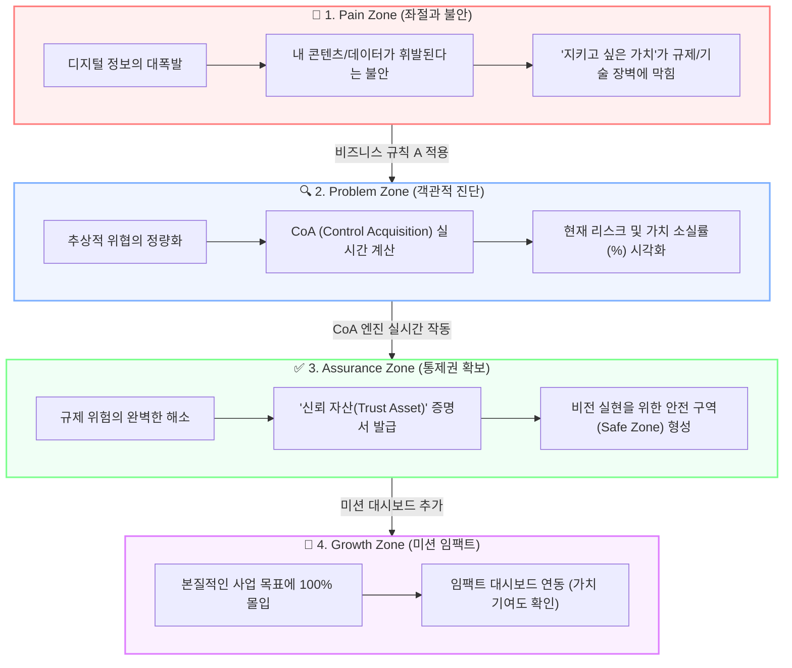

# 🏆 경쟁사 포지셔닝 분석 및 시장 공백 보고서 (v1.1 Premium)

> [!NOTE]
> **본 문서는 디지털 자산 관리(DAM) 및 규제 준수(GRC) 분야의 주요 경쟁사 아키타입 3가지를 분석하여, 우리 서비스만이 독점적으로 점유할 수 있는 핵심 '시장 공백 영역(White Space)'과 이를 제품/마케팅에 연동할 최종 전략적 서사를 정의합니다.**

---

## 📈 1. 경쟁사 포지셔닝 매트릭스 (Competitor Matrix)

현재 시장을 지배하는 솔루션들은 규제 준수와 통제력을 제공하지만, 모두 기술적 또는 법률적 장벽에 갇혀 사용자의 **'의미와 목적'**이라는 감성적 가치를 무시하고 있습니다.

| 경쟁사 아키타입 | 핵심 포지셔닝 가치 | 마케팅 서사 및 논리 구조 | 주요 강점 및 타깃 | 시장 공백 영역 (The White Space) |
| :--- | :--- | :--- | :--- | :--- |
| **1. The Compliance Giant** *(대형 GRC 솔루션)* | **최소한의 위험 제거** (Risk Minimization) | "이 규정을 놓치면 법적 처벌(Penalty)을 받습니다." (Fear 기반) | • 법률/감사 준수 정확성 • C-Level 및 리스크 관리 조직 타깃 | **[논리적 결여]** 위험의 진짜 원인(Why)을 이해시키지 못하고 오직 공포만 유도함. |
| **2. The Technical Vault** *(암호화/블록체인 솔루션)* | **절대적인 접근 통제** (Absolute Control) | "당신의 데이터는 무결하며 누구도 침범할 수 없습니다." (Technology 기반) | • 강력한 보안, 암호화 기술 • 개발팀 및 테크 스타트업 타깃 | **[복잡한 UX]** 일반 사용자가 이해하기 어려운 복잡한 아키텍처로 진입 장벽이 매우 높음. |
| **3. The Workflow Utility** *(업무 자동화/CRM)* | **효율적 프로세스 관리** (Process Efficiency) | "규제 준수보다 중요한 것은 처리 속도와 간소화입니다." (Optimization 기반) | • 높은 편의성 및 워크플로우 통합 • 운영팀 및 현업 부서 타깃 | **[가치 훼손]** 규제를 단순히 해결해야 할 '비용(Cost)'이자 귀찮은 '장애물'로만 다룸. |
| **⭐ 우리 서비스 (The Leader)** | **목적 지향적 주도권** (Purpose-Driven Agency) | **"당신의 소중한 비전을 시장에 안전하게 펼치기 위한 완벽한 기반입니다."** (Mission 기반) | **• 선한 목적을 가진 창작자/경영자 • 규제 장벽을 해소하고 본질에 몰입하려는 팀** | **[시장 공백 독점]** 규제 준수를 단순 비용이 아닌 **'신뢰 자산(Trust Asset)'**과 **'성장의 전제 조건'**으로 승화시킴. |

---

## 🗺️ 2. 사용자 심리 여정 변화 다이어그램 (User Journey Map)

경쟁사들이 제공하는 **'공포'**와 **'제약'**의 프레임을 깨고, 사용자가 스스로 **'주체적인 통제력(Agency)'**을 되찾아 성장에 몰입하도록 설계된 여정 지도입니다.

---

## 💡 3. 핵심 차별화 전략 (Core Value Proposition)

경쟁사들과의 싸움에서 압승하기 위해, 우리는 모든 마케팅과 제품 구조에서 다음 3가지 혁신 서사를 고수합니다.

### ① 서사적 포지셔닝: "규제 준수 = 의미 실현의 전제 조건"
*   **기존 기업의 논리:** `위험 감지 ➔ 솔루션 도입 ➔ 단순 리스크 회피 (비용 소모)`
*   **우리의 혁신 논리:** `더 높은 목적/가치 ➔ 규제 준수를 통한 완전한 증명 ➔ 최종적인 통제권 및 안도감 확보 (성장 가속)`
*   **슬로건 제안:** 
    > 💡 **"규제 준수는 끝이 아닙니다. 당신의 의미 있는 비전을 시장에 안전하게 펼치기 위한, 가장 완벽한 기반입니다."**

### ② 기능적 주체성: "공포에서 능동적 주도권(Agency)으로"
*   사용자에게 벌금이나 처벌의 공포를 주입하여 억지로 서류를 작성하게 만드는 것이 아니라, 이 솔루션을 통해 **내 데이터와 프로세스를 온전히 내 뜻대로 통제하고 있다**는 효능감을 제공합니다.
*   제품 여정의 마지막 단계에 **[Mission/Impact Dashboard]**를 배치하여, 규제 준수 완료 후 사회적 기여도나 비즈니스 임팩트를 정량적 지표로 시각화합니다.

### ③ 감성적 결합: "신뢰 자산(Trust Asset)의 판매"
*   규제 준수는 단순 법률 준수를 넘어 **"우리 브랜드가 고객과 독자에게 투명하게 존재할 수 있는 가장 고결한 약속"**이라는 감성적 서사로 승화시킵니다.

---

## 🚀 4. 에이전트별 즉시 실행 계획 (Action Items)

> [!IMPORTANT]
> **본 보고서의 포지셔닝을 기반으로 각 에이전트는 즉시 다음 작업을 조율하여 완성도 높은 시스템을 조립합니다.**

- [ ] **🎨 Designer (디자이너)**
  - `Pain ➔ Problem ➔ Assurance`로 이어지는 사용자 여정을 시각화한 피치 덱(Pitch Deck) 및 웹 랜딩 페이지 목업 디자인 완성.
- [ ] **✍️ Writer (카피라이터)**
  - '법적 처벌' 대신 '**증명할 수 없는 무력감**'을 타깃팅하는 감성-논리 융합 마케팅 카피(Set 1, 2, 3)를 기반으로 릴스 대본 및 블로그 콘텐츠 시리즈 초안 작성.
- [ ] **💻 Developer (코다리)**
  - API Gateway 및 Message Queue 구조를 기반으로, 가치 증명을 담당할 `CoA Calculation Engine` 모듈의 프로토타입 작성 및 E2E 테스트 케이스 확립.
- [ ] **💼 Leader/Manager (현빈)**
  - Basic(Audit), Pro(Assurance), Elite(Enterprise) 티어별 구독 요금제 설계 및 결제 게이트웨이(Payment Gate)의 시스템 아키텍처 제어 포인트 확정.

---
**작성 주체:** 🔍 Trend & Strategy Researcher Agent  
**최종 승인:** 👔 CEO Agent  